# Desarrollo del Sistema Profile Manager

**Equipo de trabajo:** Pablo Manjarres, Valentina Barbosa
**Versión:** 1.0
**Nombre del Producto:** Moonlight

Universidad EAFIT — Departamento de Informática y Sistemas — Ingeniería de Software

## Contenido

- [Sección 1. Generalidades del proyecto](#sección-1-generalidades-del-proyecto)
  - [1.1. Descripción del problema y su solución (software)](#11-descripción-del-problema-y-su-solución-software)
  - [1.2. Personas y roles del proyecto](#12-personas-y-roles-del-proyecto)
  - [1.3. Público objetivo y contexto](#13-público-objetivo-y-contexto)
  - [1.4. Descripción del proceso de interacción](#14-descripción-del-proceso-de-interacción)
- [Sección 2. Exploración de antecedentes y aplicaciones similares](#sección-2-exploración-de-antecedentes-y-aplicaciones-similares)
- [Sección 3. Artefactos y Actividades Ágiles](#sección-3-artefactos-y-actividades-ágiles)
  - [3.1 Ceremonias Ágiles](#31-ceremonias-ágiles)
  - [3.2. Visión de producto y User Story mapping](#32-visión-de-producto-y-user-story-mapping)
  - [3.3. Backlog de producto](#33-backlog-de-producto)
  - [3.4. Sprint Backlog](#34-sprint-backlog)
- [Sección 4. Sketches Iniciales](#sección-4-sketches-iniciales)
- [Sección 5. Prueba de concepto y funcionalidades iniciales](#sección-5-prueba-de-concepto-y-funcionalidades-iniciales)
- [Sección 6. Referencias y fuentes](#sección-6-referencias-y-fuentes)

---

## Sección 1. Generalidades del proyecto

### 1.1. Descripción del problema y su solución (software)

En la actualidad, muchas personas deben completar repetidamente la misma información cada vez que se postulan a una oferta laboral, aun cuando ya cuentan con un perfil profesional completo. Esto hace que el proceso de búsqueda de empleo sea lento, repetitivo y propenso a errores. Además, los candidatos no siempre saben cuáles vacantes se ajustan mejor a su perfil, por lo que invierten tiempo revisando oportunidades que no cumplen con sus habilidades o preferencias. El reto consiste en desarrollar un portal web que centralice la información del usuario, facilite la gestión de un perfil completo y ofrezca un sistema de recomendación básico que permita identificar las vacantes más compatibles de manera rápida, y eficiente.

### 1.2. Personas y roles del proyecto

| Persona | Nombre | Descripción del Rol |
| --- | --- | --- |
| Scrum Master | Elizabeth Suescún (profesora) | Facilita el proceso, define el marco de trabajo y evalúa los avances del equipo. |
| Product Owner | Juan Camilo, Luis Miguel | Representan a Magneto. Definen y priorizan las necesidades del producto y validan el entendimiento del problema. |
| Líder Técnico | Santiago Manco | Asesoría técnica y revisión de los avances del equipo. |
| Integrante 1 equipo | Pablo Manjarres | Líder del equipo. Dirige el proyecto, define la arquitectura y construye el producto. |
| Integrante 2 equipo | Valentina Barbosa | Documentación y comunicación. Elabora el documento de la entrega, la presentación, los artefactos de apoyo, y define las condiciones de aceptación. |

### 1.3. Público objetivo y contexto

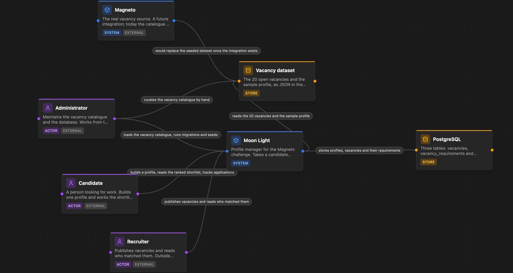

### 1.4. Descripción del proceso de interacción

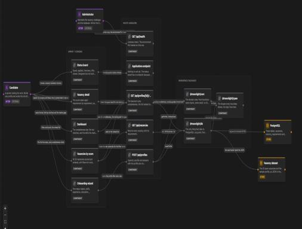

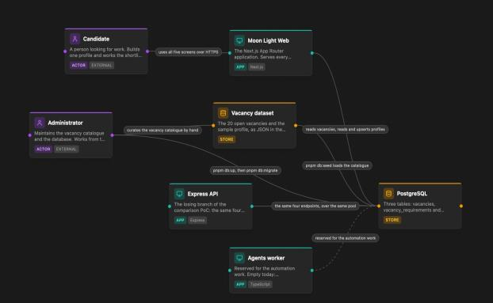

---

## Sección 2. Exploración de antecedentes y aplicaciones similares

### 1. Jobscan — https://www.jobscan.co

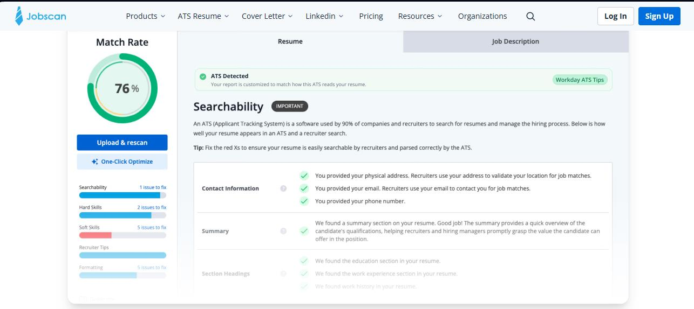

Jobscan permite comparar un currículum con una oferta de empleo para calcular qué tan compatible es el candidato con esa vacante. Analiza palabras clave, habilidades y otros elementos que suelen evaluar los sistemas ATS (Applicant Tracking Systems), mostrando un porcentaje de coincidencia y recomendaciones para mejorar el perfil.

**Funciones de Moonlight que lo diferencian:**

- Trabaja directamente con el perfil de LinkedIn.
- Calcula el porcentaje de completitud del perfil.
- Almacena la información del usuario en una base de datos PostgreSQL.
- Permite visualizar varias vacantes ordenadas según su compatibilidad, en lugar de analizar únicamente una oferta.

### 2. Teal — https://www.tealhq.com

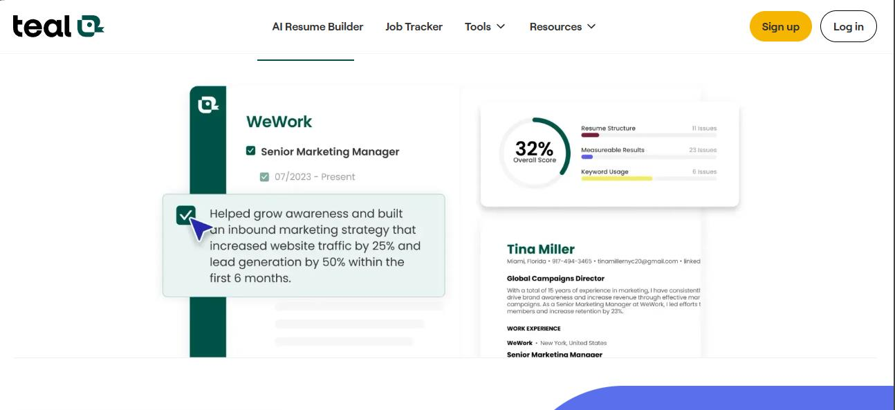

Teal es una plataforma que ayuda a organizar la búsqueda de empleo. Permite crear diferentes versiones del currículum, administrar postulaciones, analizar la compatibilidad con ofertas laborales y utilizar herramientas de inteligencia artificial para mejorar el contenido del perfil profesional.

**Funciones de Moonlight que lo diferencian:**

- Importar automáticamente la información desde LinkedIn.
- Calcular el nivel de compatibilidad con las vacantes.
- Identificar las habilidades faltantes para cada oferta.
- Ofrecer una experiencia sencilla orientada al análisis del perfil, sin incluir un sistema completo de seguimiento de postulaciones.

### 3. Resume Worded — https://resumeworded.com

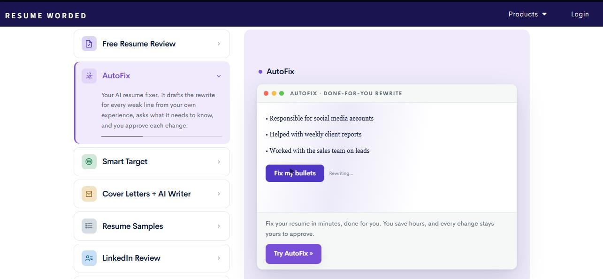

Resume Worded evalúa currículums y perfiles de LinkedIn, proporcionando una puntuación y recomendaciones para mejorar la presentación del candidato. También ofrece retroalimentación sobre fortalezas, palabras clave y oportunidades de optimización para aumentar las posibilidades de conseguir entrevistas.

**Funciones de Moonlight que lo diferencian:**

- Comparar automáticamente el perfil con un conjunto de vacantes.
- Ordenar las ofertas según el porcentaje de compatibilidad.
- Mostrar las habilidades que faltan para cada vacante.
- Servir como una herramienta de apoyo para la toma de decisiones durante la búsqueda de empleo.

---

## Sección 3. Artefactos y Actividades Ágiles

### 3.1 Ceremonias Ágiles

Durante el desarrollo de la primera entrega se realizaron tres reuniones presenciales entre los integrantes del equipo. En estas reuniones se discutió la idea para dar solución al reto planteado, se definieron los roles y responsabilidades de cada integrante, se distribuyeron las tareas y se estableció la forma de trabajo para el desarrollo del proyecto. Adicionalmente, se realizó una reunión con el Product Owner, en la que se revisó el avance del proyecto.

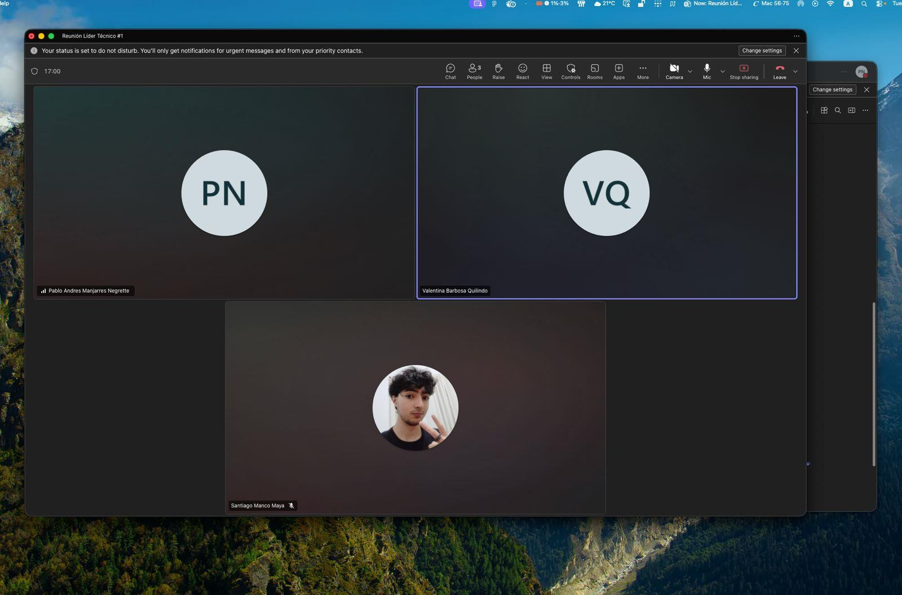

### 3.2. Visión de producto y User Story mapping

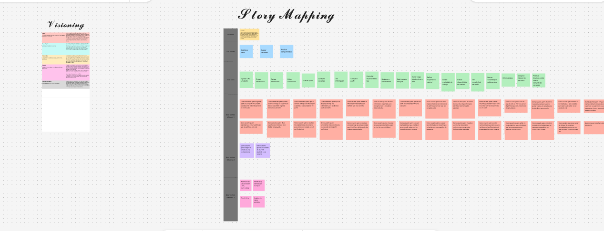

### 3.3. Backlog de producto

https://github.com/users/pablomanjarres/projects/3/views/1

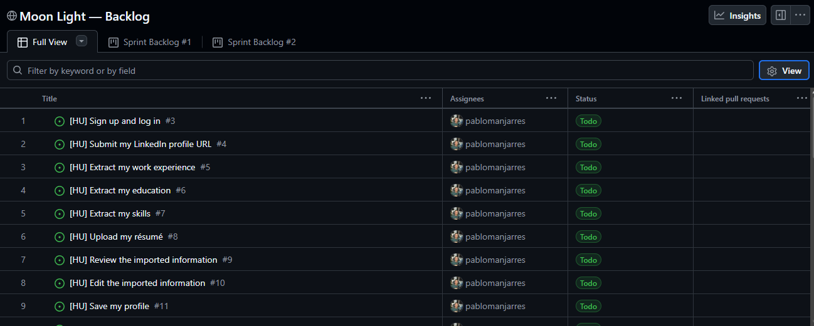

### 3.4. Sprint Backlog

https://github.com/users/pablomanjarres/projects/3/views/2

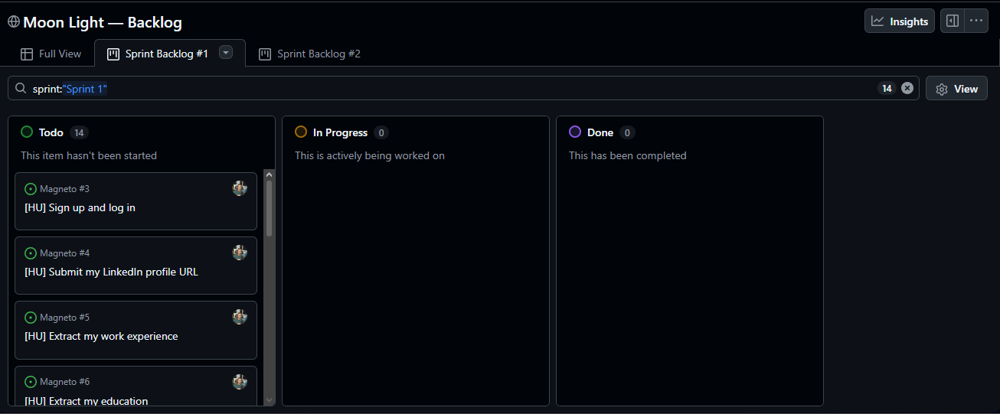

---

## Sección 4. Sketches Iniciales

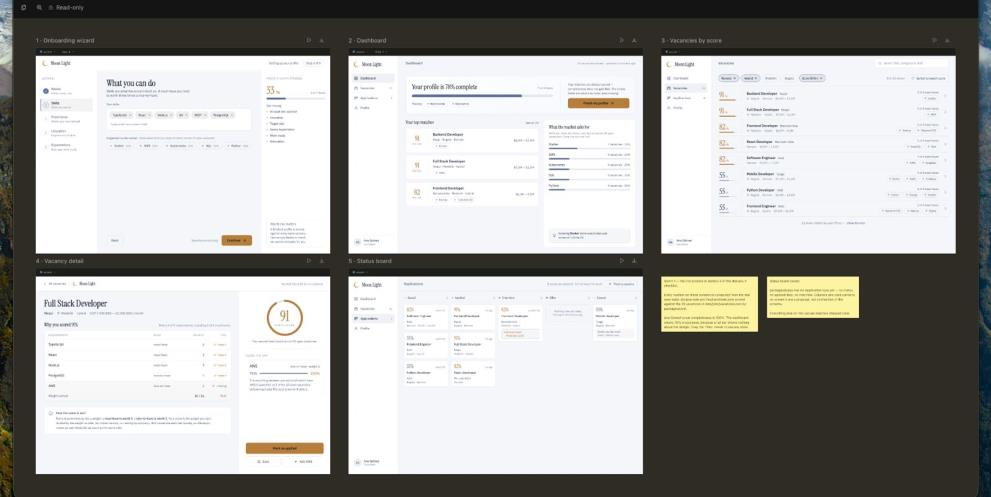

[PENDIENTE: boceto a mano alzada — `Bocetos_260819_194535.pdf`]

---

## Sección 5. Prueba de concepto y funcionalidades iniciales

El video correspondiente a la prueba de concepto de Moonlight estará disponible en el repositorio del proyecto, junto con los demás recursos asociados a la entrega.

[PENDIENTE: enlace del video]

---

## Sección 6. Referencias y fuentes

Durante el desarrollo de este trabajo se utilizó ChatGPT (OpenAI) y Claude (Anthropic) como herramienta de apoyo para:

- Revisar la redacción y la coherencia de algunos apartados del documento.
- Contrastar y depurar las historias de usuario definidas por el equipo.
- Validar la consistencia del Story Mapping.
- Apoyar la redacción de la visión del producto.
- Aclarar dudas sobre metodología ágil y sobre el formato de la entrega.
- Asistir el desarrollo del MVP.
- Generar el logo a partir de un boceto elaborado a mano por el equipo.
- Apoyar la redacción de la documentación.

La información generada fue revisada, adaptada y validada por los integrantes del equipo antes de incorporarla al documento final.
